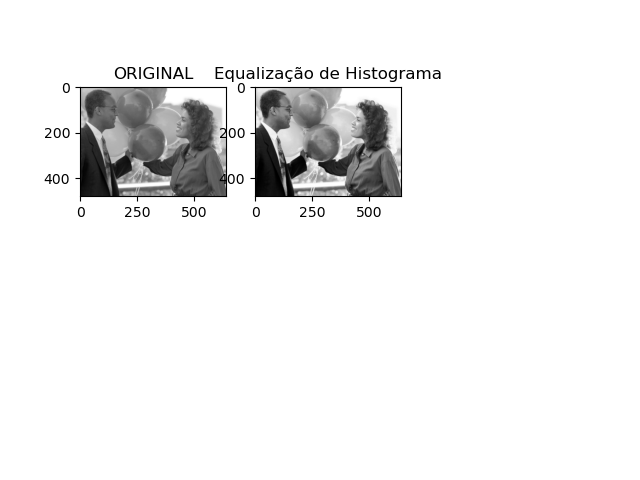

<h1 align="center">
    
</h1>

<h1 align="center">
   👍 <a href="#"> study of threads for operating systems </a>
</h1>

<h3 align="center">
    study of threads for operating systems, with image processing
</h3>

<p align="center">
  

  

  <!-- <a href="https://www.twitter.com/tgmarinho/">
    
  </a> -->

  <a href="https://github.com/jhonatheberson/threads-SO/releases">
        
  </a>
  <a href="https://github.com/jhonatheberson/threads-SO/commits/master">
    
  </a>

   
   <a href="https://github.com/jhonatheberson/threads-SO/stargazers">
    
  </a>

  <a href="https://github.com/jhonatheberson">
    
  </a>
  
  <!-- <a href="https://blog.rocketseat.com.br/">
    
    </a>  -->
</p>

<h4 align="center"> 
	 Status: development
    <!-- Status: Finished -->
</h4>

<p align="center">
 <a href="#about">About</a> •
 <a href="#features">Features</a> •
 <a href="#layout">Layout</a> • 
 <a href="#how-it-works">How it works</a> • 
 <a href="#tech-stack">Tech Stack</a> • 
 <a href="#contributors">Contributors</a> • 
 <a href="#author">Author</a> • 
 <a href="#user-content-license">License</a>

</p>

## About

🌌
Project of using thread to make the treatment of images using the procedures of Contrast enlargement and Equalization of histogram. Each thread is responsible for one of the procedures.

---

## Features

- [x] Contrast widening
- [x] Histogram Equalization
- [x] Thread creation

<!--
## Layout

The application layout is available on Figma:

<a href="https://www.figma.com/file/1SxgOMojOB2zYT0Mdk28lB/Ecoleta?node-id=136%3A546">
  
</a>

### Mobile

<p align="center">
  

  
</p>

### Web

<p align="center" style="display: flex; align-items: flex-start; justify-content: center;">
  

  
</p>

--- -->

## How it works

This project is divided into three parts:

1. Histogram Equalization (equalization.py)
2. Contrast enlargement (enlargement.py)
3. Threads (threads.py)

run the threads.py file to start.

### Pre-requisites

Before you begin, you will need to have the following tools installed on your machine:
[Git](https://git-scm.com), [Opencv](https://opencv.org/), [NumPy](https://numpy.org/), [Matplot](https://matplotlib.org/).
In addition, it is good to have an editor to work with the code like [VSCode] (https://code.visualstudio.com/)

#### Rodando

```bash

# Clone this repository
$ git clone git@github.com:jhonatheberson/threads-SO.git

# creating an environment
$ conda create -n py37env python=3.7

#activating environment
$ python conda activate py37env

# install the dependencies
$ conda env install -f libs.yml

# update the dependencies
$ conda env update -f libs.yml

# Run the application in development mode
$ python equalization.py

```

<!--
<p align="center">
  <a href="https://github.com/tgmarinho/README-ecoleta/blob/master/Insomnia_API_Ecoletajson.json" target="_blank"></a>
</p>

#### Running the web application (Frontend)

```bash

# Clone this repository
$ git clone git@github.com: tgmarinho / README-ecoleta.git

# Access the project folder in your terminal
$ cd README-ecoleta

# Go to the Front End application folder
$ cd web

# Install the dependencies
$ npm install

# Run the application in development mode
$ npm run start

# The application will open on the port: 3000 - go to http://localhost:3000

``` -->

---

## Tech Stack

The following tools were used in the construction of the project:

**thread** ([python](https://www.python.org/))

- **[OpenCV](https://opencv.org/)**
- **[Anaconda](https://www.anaconda.com/)**
- **[Tensorflow](https://www.tensorflow.org/learn?hl=pt-br)**
- **[matplotlib](https://matplotlib.org/)**
- **[scipy](https://www.scipy.org/)**
- **[sciki-learn](https://scikit-learn.org/stable/)** -**[threading](https://docs.python.org/3/library/threading.html)**

<!-- #### **Website** ([React](https://reactjs.org/) + [TypeScript](https://www.typescriptlang.org/))

- **[React Router Dom](https://github.com/ReactTraining/react-router/tree/master/packages/react-router-dom)**
- **[React Icons](https://react-icons.github.io/react-icons/)**
- **[Axios](https://github.com/axios/axios)**
- **[Leaflet](https://react-leaflet.js.org/en/)**
- **[React Leaflet](https://react-leaflet.js.org/)**
- **[React Dropzone](https://github.com/react-dropzone/react-dropzone)**

> See the file [package.json](https://github.com/tgmarinho/README-ecoleta/blob/master/web/package.json)

#### [](https://github.com/tgmarinho/Ecoleta#server-nodejs--typescript)**Server** ([NodeJS](https://nodejs.org/en/) + [TypeScript](https://www.typescriptlang.org/))

- **[Express](https://expressjs.com/)**
- **[CORS](https://expressjs.com/en/resources/middleware/cors.html)**
- **[KnexJS](http://knexjs.org/)**
- **[SQLite](https://github.com/mapbox/node-sqlite3)**
- **[ts-node](https://github.com/TypeStrong/ts-node)**
- **[dotENV](https://github.com/motdotla/dotenv)**
- **[Multer](https://github.com/expressjs/multer)**
- **[Celebrate](https://github.com/arb/celebrate)**
- **[Joi](https://github.com/hapijs/joi)**

> See the file [package.json](https://github.com/tgmarinho/README-ecoleta/blob/master/server/package.json)

#### [](https://github.com/tgmarinho/Ecoleta#mobile-react-native--typescript)**Mobile** ([React Native](http://www.reactnative.com/) + [TypeScript](https://www.typescriptlang.org/))

- **[Expo](https://expo.io/)**
- **[Expo Google Fonts](https://github.com/expo/google-fonts)**
- **[React Navigation](https://reactnavigation.org/)**
- **[React Native Maps](https://github.com/react-native-community/react-native-maps)**
- **[Expo Constants](https://docs.expo.io/versions/latest/sdk/constants/)**
- **[React Native SVG](https://github.com/react-native-community/react-native-svg)**
- **[Axios](https://github.com/axios/axios)**
- **[Expo Location](https://docs.expo.io/versions/latest/sdk/location/)**
- **[Expo Mail Composer](https://docs.expo.io/versions/latest/sdk/mail-composer/)**

> See the file [package.json](https://github.com/tgmarinho/README-ecoleta/blob/master/mobile/package.json)

#### [](https://github.com/tgmarinho/Ecoleta#utilit%C3%A1rios)**Utilitários**

- Prototype: **[Figma](https://www.figma.com/)** → **[Protótipo (Ecoleta)](https://www.figma.com/file/1SxgOMojOB2zYT0Mdk28lB/Ecoleta)**
- API: **[IBGE API](https://servicodados.ibge.gov.br/api/docs/localidades?versao=1)** → **[API de UFs](https://servicodados.ibge.gov.br/api/docs/localidades?versao=1#api-UFs-estadosGet)**, **[API de Municípios](https://servicodados.ibge.gov.br/api/docs/localidades?versao=1#api-Municipios-estadosUFMunicipiosGet)**
- Maps: **[Leaflet](https://react-leaflet.js.org/en/)**
- Editor: **[Visual Studio Code](https://code.visualstudio.com/)** → Extensions: **[SQLite](https://marketplace.visualstudio.com/items?itemName=alexcvzz.vscode-sqlite)**
- Markdown: **[StackEdit](https://stackedit.io/)**, **[Markdown Emoji](https://gist.github.com/rxaviers/7360908)**
- Commit Conventional: **[Commitlint](https://github.com/conventional-changelog/commitlint)**
- API Test: **[Insomnia](https://insomnia.rest/)**
- Icons: **[Feather Icons](https://feathericons.com/)**, **[Font Awesome](https://fontawesome.com/)**
- Fonts: **[Ubuntu](https://fonts.google.com/specimen/Ubuntu)**, **[Roboto](https://fonts.google.com/specimen/Roboto)** -->

---

## Contributors

A big thanks to this group that made this product leave the field of idea and enter the app stores :)

You are an awesome team! :)

<table>
  <tr>
    <td align="center"><a href="https://github.com/Diegooliver2"><br /><sub><b>Diego de Oliveira</b></sub></a><br /><a href="https://github.com/Diegooliver2" title="Diego"></a></td>
    <td align="center"><a href="https://github.com/angelolmg"><br /><sub><b>Angelo Leite</b></sub></a><br /><a href="https://github.com/angelolmg" title="Angelo"></a></td>
     <td align="center"><a href="https://github.com/Fagner94"><br /><sub><b>Fagner94</b></sub></a><br /><a href="https://github.com/Fagner94" title="Fagner94"></a></td>
     <!--
    <td align="center"><a href="https://rocketseat.com.br"><br /><sub><b>Claudio Orlandi</b></sub></a><br /><a href="https://rocketseat.com.br/" title="Rocketseat"></a></td>
    <td align="center"><a href="https://rocketseat.com.br"><br /><sub><b>Vinícios Fraga</b></sub></a><br /><a href="https://rocketseat.com.br/" title="Rocketseat"></a></td>
    <td align="center"><a href="https://rocketseat.com.br"><br /><sub><b>Hugo Duarte</b></sub></a><br /><a href="https://rocketseat.com.br/" title="Rocketseat"></a>  <a href="https://blog.rocketseat.com.br/" title="Blog">🌐</a></td> -->
<!-- 
  </tr>
  <tr>
    <td align="center"><a href="https://rocketseat.com.br"><br /><sub><b>Joseph Oliveira</b></sub></a><br /><a href="https://rocketseat.com.br/" title="Rocketseat"></a></td>
    <td align="center"><a href="https://rocketseat.com.br"><br /><sub><b>Guilherme Rodz</b></sub></a><br /><a href="https://rocketseat.com.br/" title="Rocketseat"></a></td>
    <td align="center"><a href="https://rocketseat.com.br"><br /><sub><b>Mayk Brito</b></sub></a><br /><a href="https://rocketseat.com.br/" title="Rocketseat"></a></td>
    <td align="center"><a href="https://rocketseat.com.br"><br /><sub><b>João Paulo</b></sub></a><br /><a href="https://rocketseat.com.br/" title="Rocketseat"></a></td>
    <td align="center"><a href="https://rocketseat.com.br"><br /><sub><b>Luke Morales</b></sub></a><br /><a href="https://rocketseat.com.br/" title="Rocketseat"></a></td>
     <td align="center"><a href="https://rocketseat.com.br"><br /><sub><b>Luiz Batanero</b></sub></a><br /><a href="https://rocketseat.com.br/" title="Rocketseat"></a></td> -->

  </tr>
</table>

## How to contribute

1. Fork the project.
2. Create a new branch with your changes: `git checkout -b my-feature`
3. Save your changes and create a commit message telling you what you did: `git commit -m" feature: My new feature "`
4. Submit your changes: `git push origin my-feature`
   > If you have any questions check this [guide on how to contribute](./CONTRIBUTING.md)

---

## Author

<a href="https://github.com/jhonatheberson">
 
 <br />
 <sub><b>Jhonat Heberson</b></sub></a> <a href="https://github.com/jhonatheberson" title="Github"></a>
 <br />

<!-- [](https://twitter.com/tgmarinho)  -->

[](https://www.linkedin.com/in/jhonat-heberson-64816616a/)
[](mailto:jhonatheberson@gmail.com)

---

## License

This project is under the license [MIT](./LICENSE).

---
